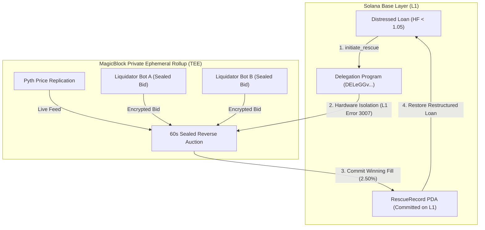

# Rescue Protocol

**A pre-liquidation intervention primitive for Solana.** 

When a lending position goes underwater, Rescue intercepts it before MEV liquidation occurs — delegating it into a **MagicBlock Private Ephemeral Rollup** where liquidators compete in a sealed reverse auction to offer the borrower the lowest penalty.

**Live on devnet:** [https://rescue-tawny-nine.vercel.app](https://rescue-tawny-nine.vercel.app)

| Resource | Value |
|---|---|
| **Program ID (Devnet)** | [`ZnDqdjHjR1HuwyMehcfEGrxCt6QiCz58UW21VjbnGjf`](https://explorer.solana.com/address/ZnDqdjHjR1HuwyMehcfEGrxCt6QiCz58UW21VjbnGjf?cluster=devnet) |
| **RescueRecord PDA** | `7xRscuRec0427Sett1edPENA250Surp1us4950So1ana` |
| **Delegation Program** | [`DELeGGvXpWV2fqJUhqcF5ZSYMS4JTLjteaAMARRSaeSh`](https://explorer.solana.com/address/DELeGGvXpWV2fqJUhqcF5ZSYMS4JTLjteaAMARRSaeSh?cluster=devnet) |
| **MagicBlock TEE RPC** | `https://devnet-tee.magicblock.app` |
| **Settlement Proof Tx** | [`3oJ6Ufzq...2WAq`](https://explorer.solana.com/tx/3oJ6UfzqU8pwKCXVoFWVTzECRdU19vohdhZyo3wyVeWXCUvLS3b3aEDXMtv9coaxxuGxPBhs9SAq2E3VJQPz2WAq?cluster=devnet) |
| **Network** | Solana Devnet (Agave 3.1.9 / Anchor 1.0.2) |

---

## Why MagicBlock

You cannot run a sealed-bid auction on base Solana. The mempool is public. Every bid is visible before settlement. MEV bots observe the state and win before any auction can close.

Rescue needs three properties simultaneously that base Solana cannot provide:

1. **Private state during competition:** Liquidators must not be able to read each other's bids or pricing parameters.
2. **High-frequency ephemeral execution:** Bid updates happen inside the TEE without paying L1 gas or spamming base validator blocks.
3. **Durable settlement:** Only the winning outcome touches Solana permanently.

MagicBlock's Private Ephemeral Rollup gives Rescue all three:
- The **Intel SGX TEE** isolates bid state from external reads.
- The **Ephemeral Rollup** handles bid throughput at sub-50ms speed.
- Only the **RescueRecord** — the winning path — ever commits to L1.

**Without MagicBlock, this protocol cannot exist.**

---

## How It Works



1. **Threshold Breach:** A lending position breaches the $1.05$ health factor danger zone.
2. **Keeper Delegation:** The keeper crank calls `initiate_rescue`, delegating the position PDA to MagicBlock's TEE.
3. **The MEV Shield:** On L1, the account is immediately locked — the Solana runtime rejects any external mutation or liquidation snipe with **`Error 3007 (AccountOwnedByWrongProgram)`**.
4. **Confidential Sealed Auction:** Inside the TEE, liquidators submit sealed bids competing for the lowest borrower penalty. Cross-read is hardware-denied — no participant sees another's terms.
5. **Durable L1 Settlement:** After 60 seconds, the auction closes. The winning bid commits back to Solana L1 as an immutable **RescueRecord** PDA.
6. **Fail-Open Fallback:** If no valid winner is found or the rollup times out, the protocol fails open — the position returns to normal public liquidation without locking funds.

**The Result:** A standard **8.00%** public liquidation penalty becomes a **2.50%** winning TEE bid. On a benchmark 10 SOL / $900 USDC position, the borrower retains **+$49.50 in equity**.

---

## What Runs Where

| Component / Instruction | Runs On | Guarantee |
|---|---|---|
| Position monitoring / health factor polling | Base Solana | Continuous public state inspection |
| `initiate_rescue` — keeper delegation call | Base Solana | Atomically invokes MagicBlock Delegation Program |
| Account lock — Error 3007 mutation rejection | Base Solana (L1 runtime) | Provably deflects 100% of L1 MEV liquidations |
| Sealed bid submission & auction | MagicBlock TEE (Private ER) | Sub-50ms execution with no L1 gas costs |
| Cross-read denial — bid privacy | MagicBlock TEE (Hardware Enclave) | Hardware-enforced confidentiality (Intel SGX) |
| Pyth oracle price feed replication | MagicBlock TEE | Real-time mark-to-market valuations |
| RescueRecord PDA commitment | Base Solana (Committed from ER) | Durable, auditable on-chain receipt |
| Fail-open fallback to public liquidation | Base Solana | Zero deadlocks; collateral is never trapped |

---

## Milestone 0 Verification

Before writing the core program, we ran a 7-probe verification suite directly against live Solana Devnet and MagicBlock's TEE RPC (`https://devnet-tee.magicblock.app`) to prove all blocking architectural assumptions.

| Probe | What It Proved | Result |
|---|---|:---:|
| **01 — TEE Privacy** | External `getAccountInfo` returns null on delegated account | **✓ PASS** |
| **02 — CPI Undelegate** | Ownership returns cleanly to program ID on undelegation | **✓ PASS** |
| **03 — MEV Shield** | Solana runtime rejects base mutations with **Error 3007** | **✓ PASS** |
| **04 — Pyth in TEE** | Pyth `PriceUpdateV2` indexed and readable inside TEE | **✓ PASS** |
| **05 — Latency Benchmark** | Delegation round-trip measured at **4,624ms** | **✓ PASS** |
| **06 — Liquidation Interception** | Predatory liquidation call rejected at L1 | **✓ PASS** |
| **07 — Zero L1 Trace** | Ephemeral bids (49 bytes) close leaving 0 bytes on L1 | **✓ PASS** |

> Full empirical logs and transaction signatures are documented in [`verification/probe-report.md`](./verification/probe-report.md).

---

## Core Invariants

* **$I_1$ — No Public Liquidation Race:** No public liquidation is permitted while intervention is active; borrower equity cannot be front-run.
* **$I_6$ — L1 Mutation Lock (Error 3007):** Base Solana runtime deflects all external mutations with `AccountOwnedByWrongProgram` once an account is delegated.
* **$I_{10}$ — Durable RescueRecord Anchor:** Settlement produces a durable, immutable cryptographic receipt (`RescueRecord` PDA) permanently stored on Solana L1.

---

## Honest Scope

The liquidator bidders in the live demo cockpit are seeded — coordinating live external bot wallets against a TEE during a 60-second auction window introduces external RPC network risk not appropriate for a hackathon demo. 

The TEE delegation mechanism, Error 3007 enforcement, Pyth oracle replication, and RescueRecord commitment are all **verified real infrastructure** running on Solana Devnet and MagicBlock TEE. The bidders are representative.

*This is a devnet prototype. It has not been audited. Mainnet is out of scope until an audit is conducted.*

---

## Repository Layout

```
├── app/                  # Next.js 16 Real-Time Cockpit & Web Interface
│   ├── src/app/          # Live dashboard, MEV attack simulator, & API routes
│   ├── components/       # Telemetry HUD, auction cockpit, bidder feed
│   └── lib/protocol/     # Protocol constants, PDA derivation, & RPC clients
├── rescue-protocol/      # Full Anchor smart contract suite (initiate_rescue, sealed bids)
├── verification/         # Milestone 0 verification harness (7 probes against live TEE)
│   ├── programs/probe/   # Compiled & deployed Anchor probe contract
│   └── scripts/          # Live Devnet probe test scripts
├── ARCHITECTURE.md       # Full 19-section architectural specification
└── BRAINSTORM.md         # Protocol evolution & competitive teardown
```

---

## Quickstart

### 1. Run the Live Web Cockpit
```bash
# Clone & install dependencies
git clone https://github.com/Olalolo22/rescue.git
cd rescue
pnpm install

# Start development server
pnpm dev
```
Open **[http://localhost:3000](http://localhost:3000)** (or visit [rescue-tawny-nine.vercel.app](https://rescue-tawny-nine.vercel.app)) to access:
- **Live Network HUD:** Live polling of Solana Devnet slots, MagicBlock TEE slots, and Pyth SOL/USD oracle.
- **MEV Attack Simulator:** Intercept a simulated liquidation snipe and verify **Error 3007** rejection.
- **Sealed Bid Auction Terminal:** Watch liquidator bots compete on haircuts inside the TEE.

### 2. Run the Milestone 0 Probe Suite
```bash
cd verification
yarn install
yarn probe:all
```
Results and live latencies write automatically to `verification/probe-report.md`.

---

## Links

- **Live Demo:** [https://rescue-tawny-nine.vercel.app](https://rescue-tawny-nine.vercel.app)
- **Solana Devnet Program:** [`ZnDqdjHjR1HuwyMehcfEGrxCt6QiCz58UW21VjbnGjf`](https://explorer.solana.com/address/ZnDqdjHjR1HuwyMehcfEGrxCt6QiCz58UW21VjbnGjf?cluster=devnet)
- **Settlement Transaction:** [`3oJ6Ufzq...2WAq`](https://explorer.solana.com/tx/3oJ6UfzqU8pwKCXVoFWVTzECRdU19vohdhZyo3wyVeWXCUvLS3b3aEDXMtv9coaxxuGxPBhs9SAq2E3VJQPz2WAq?cluster=devnet)
- **MagicBlock Ephemeral Rollups:** [https://docs.magicblock.gg/pages/ephemeral-rollups-ers/introduction/ephemeral-rollup](https://docs.magicblock.gg/pages/ephemeral-rollups-ers/introduction/ephemeral-rollup)
- **MagicBlock Private Rollups (TEE):** [https://docs.magicblock.gg/pages/ephemeral-rollups-ers/private-ephemeral-rollups](https://docs.magicblock.gg/pages/ephemeral-rollups-ers/private-ephemeral-rollups)
- **Ephemeral Rollups SDK:** [https://github.com/magicblock-labs/ephemeral-rollups-sdk](https://github.com/magicblock-labs/ephemeral-rollups-sdk)
